<h1 align="center">YashE-Commerce</h1>
<h2 align="center">A Backend project providing Rest Api for online shopping application. The Api can perform all the crud operation with customer validation on every step.</h2>
 
<h1>Modules</h1>
<ul>
<li><h3>Login Module</h3></li>
  <li><h3>Customer Module</h3></li>
  <li><h3>Product Module</h3></li>
  <li><h3>Order Module</h3></li>
  <li><h3>Cart Module</h3></li>
</ul>
<h1>Deployed Video Link</h1>
<ul><li><a target="_blank" href="https://drive.google.com/file/d/17o2alq8DNX1q7yQvpWKVQwQ5uvEYu7OQ/view?usp=sharing">Live Project Video Link</a></li></ul>

# Customer Controller

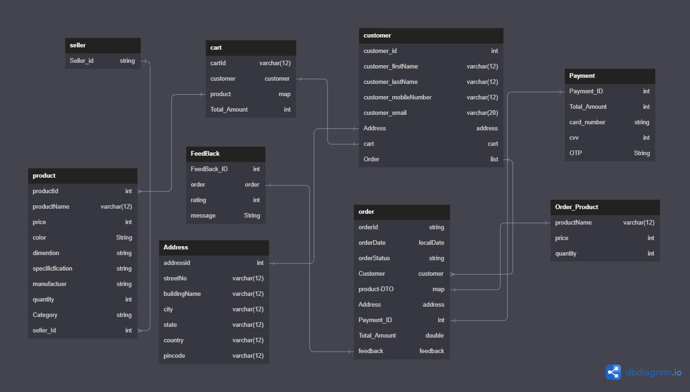

# Customer Controller

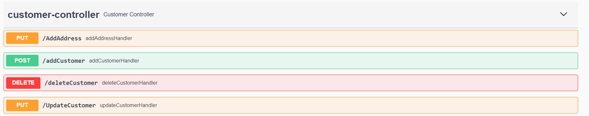

# Admin Controller

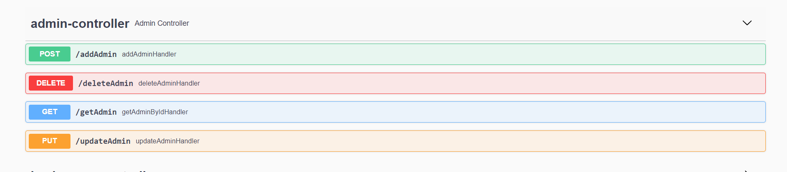

# Seller Controller

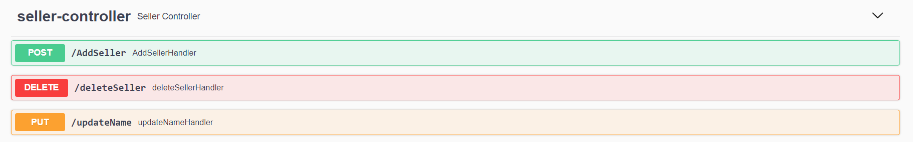

# Product Controller

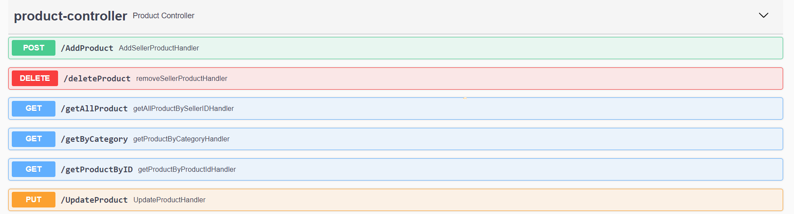

# Cart Controller

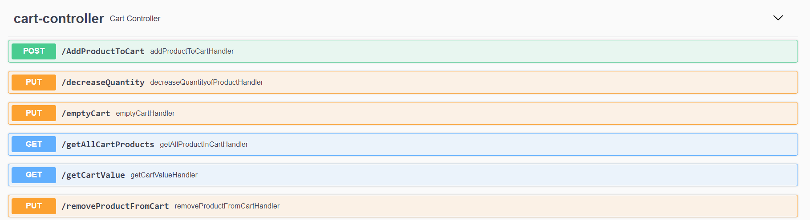

# Order Controller

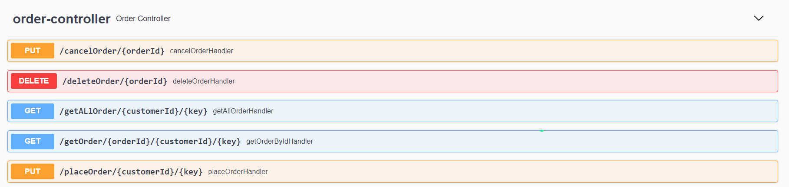

# Payment Controller

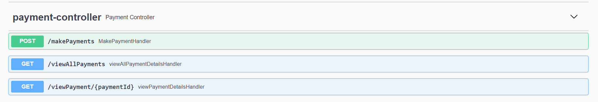

# Feedback Controller

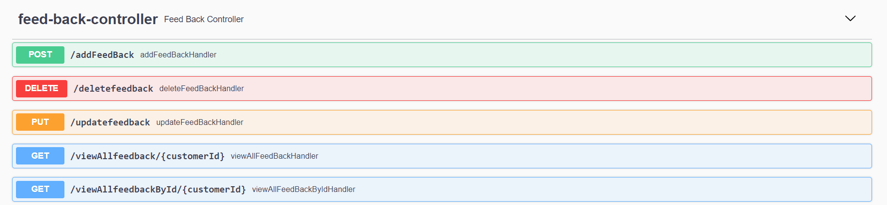

# Sales Controller

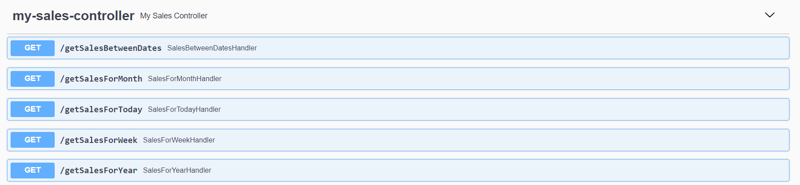

# Card Controller

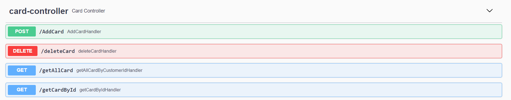

# Login controller

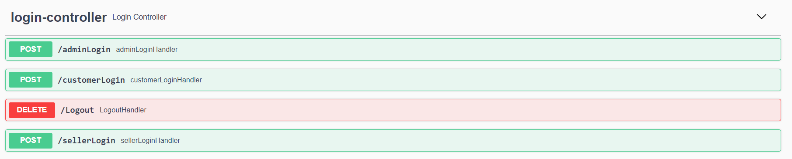
